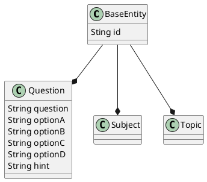

# ERD for Shule Project

```plantuml
@startuml
class "BaseEntity" as BE {
    Sting id
}

class "Question" as Q {
    String question
    String optionA
    String optionB
    String optionC
    String optionD
    String hint
}

class "Subject" as S {

}

class "Topic" as T {

}

BE --* Q
BE --* S
BE --* T

@enduml
```
