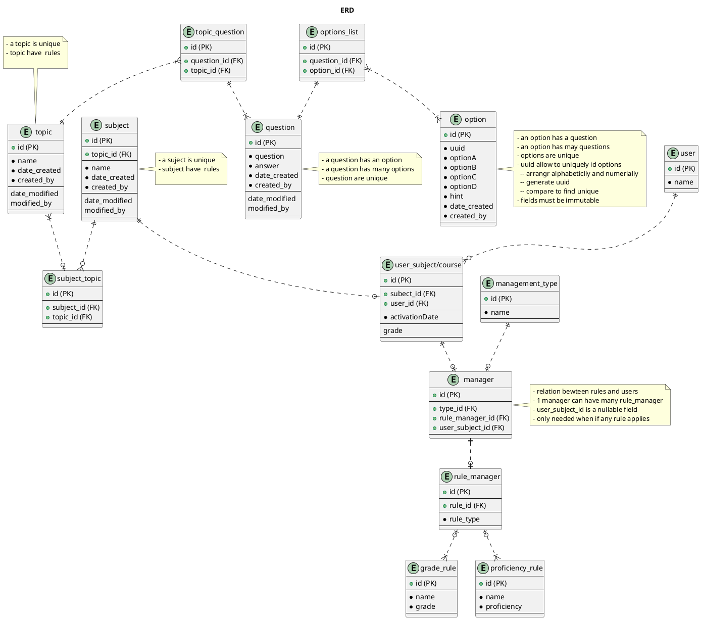

# ERD for Shule Project

```plantuml
@startuml

title ERD

entity "subject" as S {
    + id (PK)
    --
    + topic_id (FK)
    --
    * name
    * date_created
    * created_by
    --
    date_modified
    modified_by
    --
}

note right 
- a suject is unique
- subject have  rules

end note

entity "subject_topic" as ST {
    + id (PK)
    --
    + subject_id (FK)
    + topic_id (FK)
    --
}


entity "topic" as T {
    + id (PK)
    --
    * name
    * date_created
    * created_by
    --
    date_modified
    modified_by
    --
}

note top 
- a topic is unique
- topic have  rules

end note

entity "manager" as M {
    + id (PK)
    --
    + type_id (FK)
    + rule_manager_id (FK)
    + user_subject_id (FK)
    --
}

note right 
- relation bewteen rules and users
- 1 manager can have many rule_manager
- user_subject_id is a nullable field
- only needed when if any rule applies
end note

entity "topic_question" as TQ {
    + id (PK)
    --
    + question_id (FK)
    + topic_id (FK)
    --
  }

entity "question" as Q {
    + id (PK)
    --
    * question
    * answer
    * date_created
    * created_by
    --
    date_modified
    modified_by
    --
}

note right 
- a question has an option
- a question has many options
- question are unique
end note

entity "options_list" as optionsList {
    + id (PK)
    --
    + question_id (FK)
    + option_id (FK)
    --
}

entity "option" as option {
    + id (PK)
    --
    * uuid
    * optionA
    * optionB
    * optionC
    * optionD
    * hint
    * date_created
    * created_by  
    --
}

note right 
- an option has a question
- an option has may questions
- options are unique
- uuid allow to uniquely id options
  -- arrangr alphabeticlly and numerially
  -- generate uuid
  -- compare to find unique
- fields must be immutable
end note

entity "grade_rule" as grade_rule {
    + id (PK)
    --
    * name
    * grade    
    --
}

entity "proficiency_rule" as proficiency_rule {
    + id (PK)
    --
    * name
    * proficiency    
    --
}


entity "user" as U {
    + id (PK)
    --
    * name 
    --
}

entity "user_subject/course" as U_S {
    + id (PK)
    --
    + subect_id (FK)  
    + user_id (FK)
    --
    * activationDate
    --
    grade 
    --
}

entity "rule_manager" as RM {
    + id (PK)
    --
    + rule_id (FK)
    --
    * rule_type 
    --
}

entity "management_type" as MT {
    + id (PK)
    --
    * name
    --
}

S ||..o| U_S
S ||..o{ ST
  
T }|..o| ST

U ||..o{ U_S

U_S ||..o| M

optionsList ||..|| Q
optionsList }|..|{ option

TQ ||..|{ Q
TQ }|..|| T

M ||..o| RM

MT ||..o| M

RM |o..|{ grade_rule
RM |o..|{ proficiency_rule

@enduml
```

