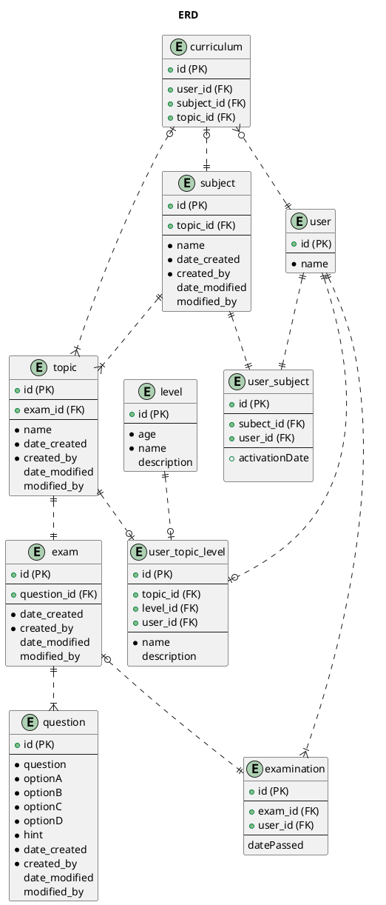

# ERD for Shule Project

```plantuml
@startuml

title ERD

entity "exam" as E {
    + id (PK)
    --
    + question_id (FK)
    --
    * date_created
    * created_by
    date_modified
    modified_by
}

entity "subject" as S {
    + id (PK)
    --
    + topic_id (FK)
    --
    * name
    * date_created
    * created_by
    date_modified
    modified_by
}

entity "topic" as T {
    + id (PK)
    --
    + exam_id (FK)
    --
    * name
    * date_created
    * created_by
    date_modified
    modified_by
}

entity "question" as Q {
    + id (PK)
    --
    * question
    * optionA
    * optionB
    * optionC
    * optionD
    * hint
    * date_created
    * created_by
    date_modified
    modified_by
}

entity "level" as L {
    + id (PK)
    --
    * age
    * name  
    description
}

entity "user" as U {
    + id (PK)
    --
    * name  
}

entity "user_subject" as U_S {
    + id (PK)
    --
    + subect_id (FK)  
    + user_id (FK)
    --
    + activationDate
    
}

entity "user_topic_level" as SYLLABUS {
    + id (PK)
    --
    + topic_id (FK)  
    + level_id (FK)
    + user_id (FK)
    --
    * name  
    description
}

entity "curriculum" as C {
    + id (PK)
    --
    + user_id (FK)  
    + subject_id (FK)
    + topic_id (FK)
  }

entity "examination" as EXAMINATION {
  + id (PK)
  --
  + exam_id (FK)
  + user_id (FK)
  --
  datePassed
}

S ||..|{ T
T ||..|| E

E ||..|{ Q
U ||..|| U_S
S ||..|| U_S

T ||..o| SYLLABUS
L ||..o| SYLLABUS
U ||..o| SYLLABUS 
  
C }o..|| U
C |o..|| S
C |o..|{ T

U ||..|{ EXAMINATION 
E |o..|| EXAMINATION

@enduml
```

