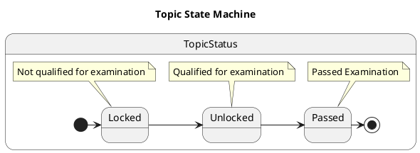

#Topic State Diagram

```plantuml
@startuml

title Topic State Machine

state TopicStatus {
    state "Passed" as Done
    state "Locked" as Locked
    state "Unlocked" as Unlocked

    [*] -> Locked 
    Locked -> Unlocked
    Unlocked -> Done
    Done -> [*]
    
    note top of Locked
        Not qualified for examination
    end note
    
    note top of Unlocked
        Qualified for examination
    end note
    
    note top of Done
        Passed Examination
    end note
}

@enduml
```
