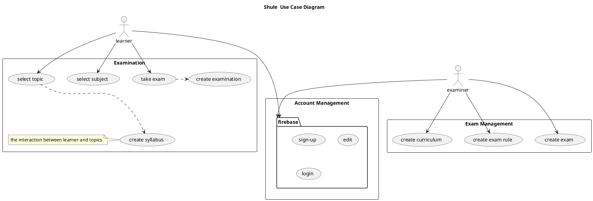

#Usecase Diagram

```plantuml
@startuml

title Shule  Use Case Diagram

actor "learner" as S_A

rectangle  "Examination" as EXAM_RECT {
    usecase "select subject" as SS
    usecase "select topic" as ST
    usecase "take exam" as TE
    usecase "create syllabus" as CREATS
    usecase "create examination" as CREATE

    note "the interaction between learner and topics" as N1

    S_A --> TE    
    TE .> CREATE
    
    S_A --> SS
    S_A --> ST
    
    ST ..> CREATS

    N1 . CREATS
}


actor "examiner" as EUSER

rectangle  "Account Management" as AM_RECT {

    
    package "firebase" as FB {
        usecase "sign-up" as SIGNUP
        usecase "edit" as UPDATE
        usecase "login" as LOGIN
    }
    

    S_A ---> FB
    EUSER --> FB
    

}

rectangle  "Exam Management" as S_RECT {
    usecase "create exam" as CS_EXAM
    usecase "create exam rule" as CR_EXAM
    usecase "create curriculum" as CREATEC 

    EUSER --> CS_EXAM
    EUSER --> CR_EXAM
    EUSER --> CREATEC
}

@enduml
```