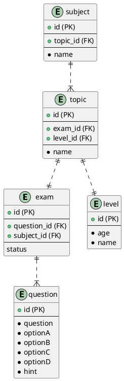

# ERD for shule project

```plantuml
@startuml

entity "exam" as E {
    + id (PK)
    --
    + question_id (FK)
    + subject_id (FK)
    --
    status
}

entity "subject" as S {
    + id (PK)
    --
    + topic_id (FK)
    --
    * name
}

entity "topic" as T {
    + id (PK)
    --
    + exam_id (FK)
    + level_id (FK)
    --
    * name
}

entity "question" as Q {
    + id (PK)
    --
    * question
    * optionA
    * optionB
    * optionC
    * optionD
    * hint
}

entity "level" as L {
    + id (PK)
    --
    * age
    * name  
}

S ||..|{ T
T ||..|| E
T ||..|| L
E ||..|{ Q

@enduml
```
